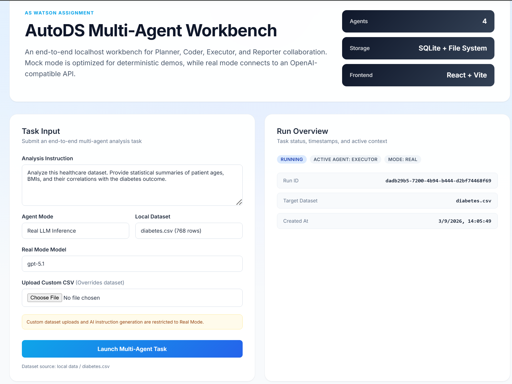
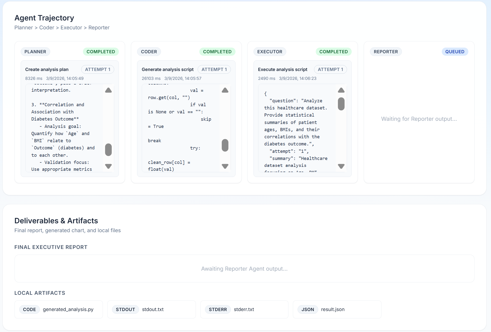

# Multi-Agent Data Analysis Workbench

A multi-agent system example. It provides a React frontend, a FastAPI backend, SQLite + local file storage, and a closed-loop collaboration of four agents: Planner, Coder, Executor, and Reporter.




## Agent Capabilities

- **Planner Agent**: Analyzes the user's request and historical context to break down the problem into actionable sub-tasks. It determines the correct execution sequence and resource requirements, generating a structured execution plan.
- **Coder Agent**: Translates the tasks defined by the Planner into concrete code (e.g., Python scripts for data processing or visualization). It ensures the generated code handles data properly, uses appropriate libraries, and includes necessary error handling.
- **Executor Agent**: Runs the code generated by the Coder in a local sandbox or execution environment. It captures standard output, standard error, and generated artifacts (like charts or processed data files). If it encounters an error, it provides the error trace back to the system for self-correction.
- **Reporter Agent**: Synthesizes the execution results, user requirements, and analysis outputs into a comprehensive, human-readable report. It formats the final response, highlighting key insights, explaining charts, and concluding the task.

## Deliverable Mapping

- Interaction interface & multi-agent system: `frontend/` + `backend/`, capable of running tasks end-to-end on localhost.
- Solution documentation: See `docs/architecture.md`.
- Codebase: This repository contains the complete code. Basic running instructions are provided below.

## Local Execution

### 1. Backend

```bash
cd backend
pip install -r requirements.txt
uvicorn app.main:app --host 127.0.0.1 --port 8000 --reload
``
**Note on Local Usage:** Use own IP address to replace [127.0.0.1]
Default local address: `http://127.0.0.1:8000`


### 2. Frontend

```bash
cd frontend
npm install
npm run dev
```

Default local address: `http://localhost:5173`

## Usage Instructions

1. Open the frontend page.
2. Enter an analytical question.
3. Select a built-in example (with default analytical question) or upload your own CSV file.
4. Provide a valid `OPENAI_API_KEY` in the `.env` file first.
5. Watch the dashboard to observe real-time LLM inference and thinking trajectories side-by-side with step executions.
6. The right panel will display the task status, step trajectories, the final report, and local artifacts.

## Directory Structure

- `backend/`: FastAPI backend, SQLite initialization, multi-agent orchestration, and local executor.
- `frontend/`: React + Vite workbench.
- `data/`: Local examples, uploaded files, runtime artifacts, and SQLite database.
- `docs/architecture.md`: Architectural overview and design decisions.
- `openspec/changes/build-local-multi-agent-mvp/`: OpenSpec change artifacts for this work.

## Environment Variables

For optional environment variables, see `.env.example`.

## Future Work

- LangGraph Integration: Transition the current linear, hard-coded orchestrator loop to a state-graph architecture. This is necessary to support non-deterministic branching (e.g., routing to a `SQL Coder` vs. a `Pandas Coder` based on input type), and native multi-tool nested ReAct loops as the application complexity grows beyond MVP.
- Support Excel, Parquet, and database connectors.
- Replace the local executor with a more secure, isolated sandbox.
- Add Prompt management, caching, and evaluation mechanisms for actual LLM execution mode.
