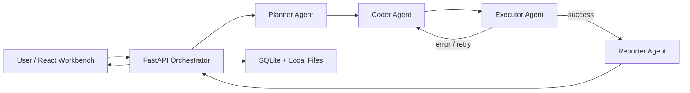

# Architecture Overview

## 1. Components

### Frontend: React Workbench

- Single-page application acting as a workbench, responsible for task submission, sample selection/CSV uploading, running status polling, agent trajectory display, and report & chart presentation.
- Interacts with the backend via `/api/*`.

### Backend: FastAPI Orchestrator

- Creates execution tasks.
- Calls Planner / Coder / Executor / Reporter.
- Maintains task and step states in SQLite.
- Manages local artifact files, including uploaded data, stdout/stderr, `result.json`, and SVG charts.

### Local Storage

- SQLite: Stores `runs`, `run_steps`, and `artifacts`.
- File system: Stores `data/uploads/`, `data/samples/`, and `data/runs/<run-id>/`.

## 2. Agent Roles

### Planner

- Inputs: User question, dataset summary.
- Outputs: A 3 to 4-step analysis plan.

### Coder

- Inputs: User question, planning results, dataset summary, retry context.
- Outputs: An executable Python analysis script.

### Executor

- Inputs: The generated Python script and the target CSV.
- Outputs: stdout, stderr, `result.json`, `chart.svg`.
- Upon failure, returns an error summary to the Coder for the next retry iteration.

### Reporter

- Inputs: Execution results and metrics summary.
- Outputs: A business-friendly Markdown report.

## 3. Orchestration / Coordination Logic

Main flow:

1. User submits a question on the frontend and selects a sample or uploads a CSV.
2. The backend creates a `run` and extracts the dataset schema / column type summary.
3. The Planner generates a plan.
4. The Coder generates a Python analysis script.
5. The Executor runs the script in an isolated local directory.
6. If it fails, records the error and loops back to the Coder until the maximum retry limit is reached.
7. Upon success, the Reporter outputs the final report.
8. The frontend polls to display the latest status, charts, and artifacts.

## 4. Tools / APIs Used

- Frontend: React + Vite.
- Backend API: FastAPI.
- Local persistence: SQLite + local file system.
- Analysis runtime: Standard Python library for generating and executing analysis scripts.
- Optional LLM API: OpenAI-compatible Chat Completions (enabled only when an API Key is configured).

## 5. Key Design Decisions

1. No dependency on a cloud database.
   Reason: Makes the project easy to submit and reproduce locally.
2. Backend analysis scripts rely mainly on standard libraries.
   Reason: Reduces setup friction and facilitates quick execution in different local environments.
3. The frontend uses polling instead of WebSockets.
   Reason: For an MVP, polling is more stable and faster to implement, and it's sufficient for displaying multi-agent execution trajectories.

## 6. Future Work

- Add more data sources such as Excel / Parquet / Database connections.
- Upgrade the local executor to a more strongly isolated sandbox.
- Add streaming logs, event timelines, and more granular observability.
- Introduce evaluations, Prompt versioning, and caching for real model calls.
