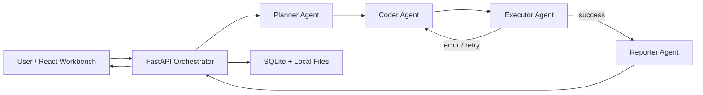

# 架构概览

## 1. 组件划分

### 前端：React Workbench

- 单页工作台，负责任务提交、样例选择/CSV 上传、运行状态轮询、代理轨迹展示、报告与图表展示。
- 通过 `/api/*` 与后端交互。

### 后端：FastAPI Orchestrator

- 创建运行任务。
- 调用 Planner / Coder / Executor / Reporter。
- 维护 SQLite 中的任务与步骤状态。
- 管理本地文件产物，包括上传数据、stdout/stderr、result.json 和 SVG 图表。

### 本地存储

- SQLite：保存 `runs`、`run_steps`、`artifacts`。
- 文件系统：保存 `data/uploads/`、`data/samples/`、`data/runs/<run-id>/`。

## 2. Agent Roles

### Planner

- 输入：用户问题、数据集摘要。
- 输出：3 到 4 步分析计划。

### Coder

- 输入：用户问题、规划结果、数据集摘要、重试上下文。
- 输出：可执行 Python 分析脚本。

### Executor

- 输入：生成的 Python 脚本与目标 CSV。
- 输出：stdout、stderr、`result.json`、`chart.svg`。
- 失败时会把错误摘要交还给 Coder，用于下一轮重试。

### Reporter

- 输入：执行结果与指标摘要。
- 输出：业务友好的 Markdown 报告。

## 3. Orchestration / Coordination Logic

主流程：

1. 用户在前端提交问题并选择样例或上传 CSV。
2. 后端创建 `run` 并提取数据集 schema / 列类型摘要。
3. Planner 生成计划。
4. Coder 生成 Python 分析脚本。
5. Executor 在本地隔离目录运行脚本。
6. 若失败，则记录错误并回到 Coder，直到达到最大重试上限。
7. 成功后，Reporter 输出最终报告。
8. 前端轮询展示最新状态、图表与产物。

## 4. Tools / APIs Used

- Frontend：React + Vite。
- Backend API：FastAPI。
- Local persistence：SQLite + 本地文件系统。
- Analysis runtime：Python 标准库生成并执行分析脚本。
- Optional LLM API：OpenAI-compatible Chat Completions（仅在配置了 API Key 时启用）。

## 5. Key Design Decisions

1. 默认使用 `mock` 模式。
   理由：保证无外部依赖时也能演示完整多代理链路。
2. 不依赖云数据库。
   理由：符合题目要求，并使项目易于本地提交和复现。
3. 后端分析脚本尽量只依赖标准库。
   理由：降低安装摩擦，方便在不同本机环境快速运行。
4. 前端采用轮询而不是 WebSocket。
   理由：MVP 更稳定、实现更快，也足以展示多代理执行轨迹。
5. 提供“模拟首次执行失败”开关。
   理由：便于笔试展示闭环修复能力，而不需要依赖偶发错误。

## 6. Future Work

- 增加 Excel / Parquet / 数据库连接等更多数据源。
- 将本地执行器升级为更强隔离的沙箱。
- 增加流式日志、事件时间线和更细粒度的可观测性。
- 引入评测、Prompt 版本管理和真实模型调用缓存。
